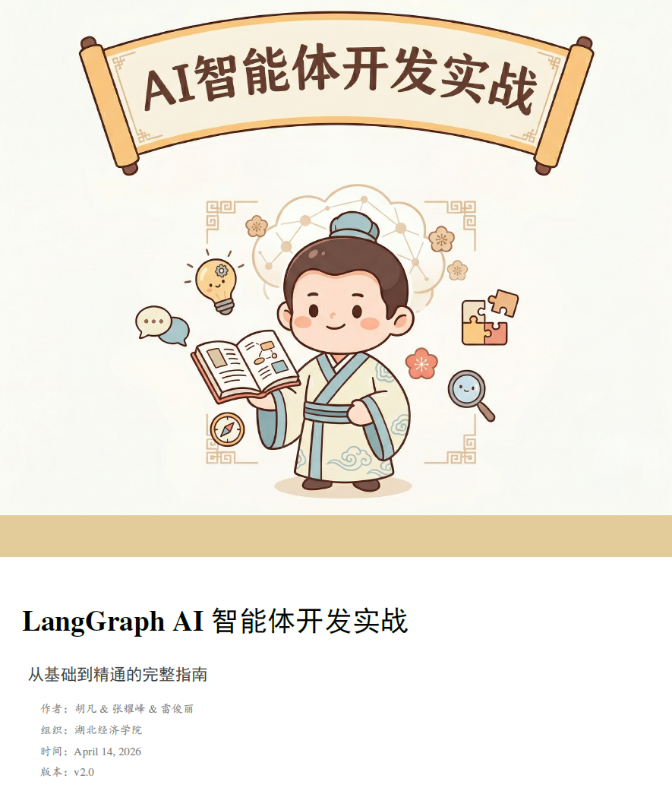
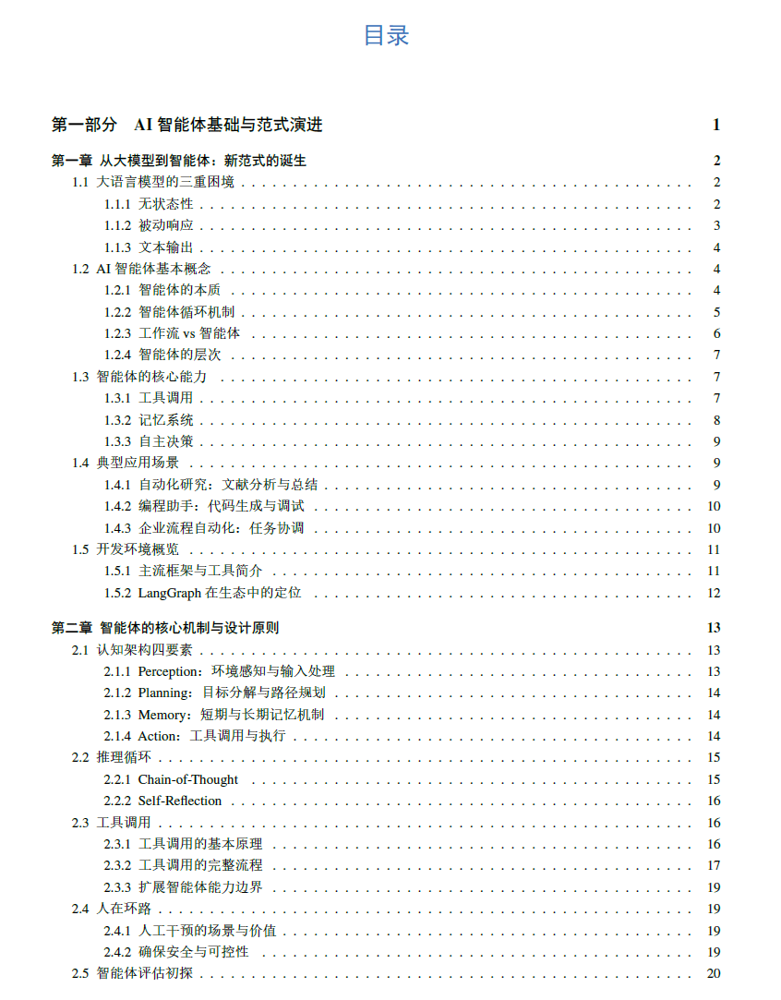
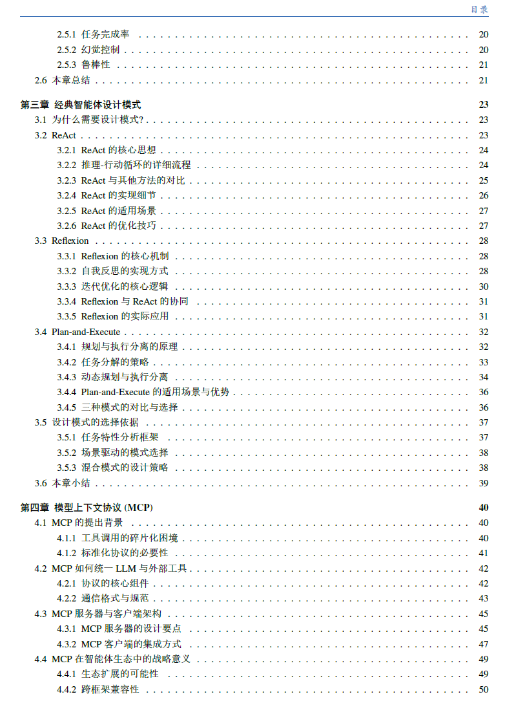
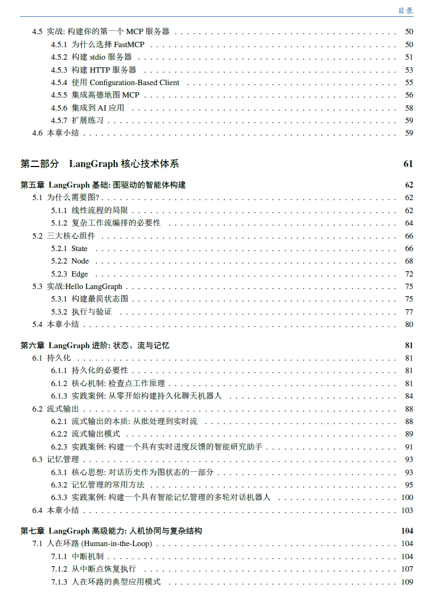
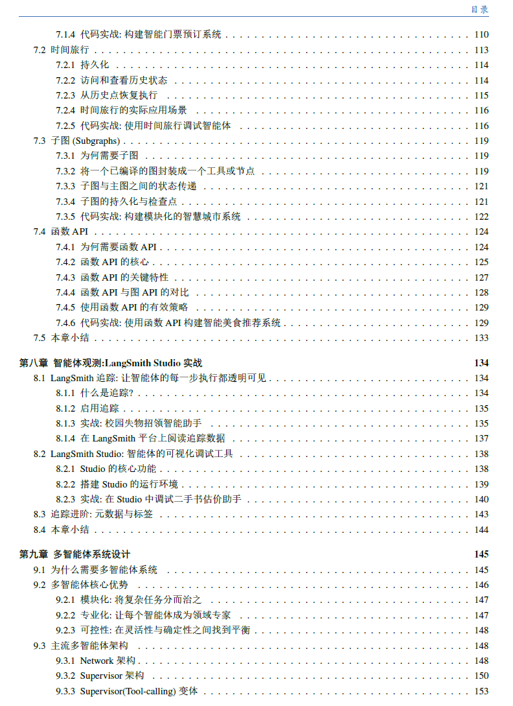
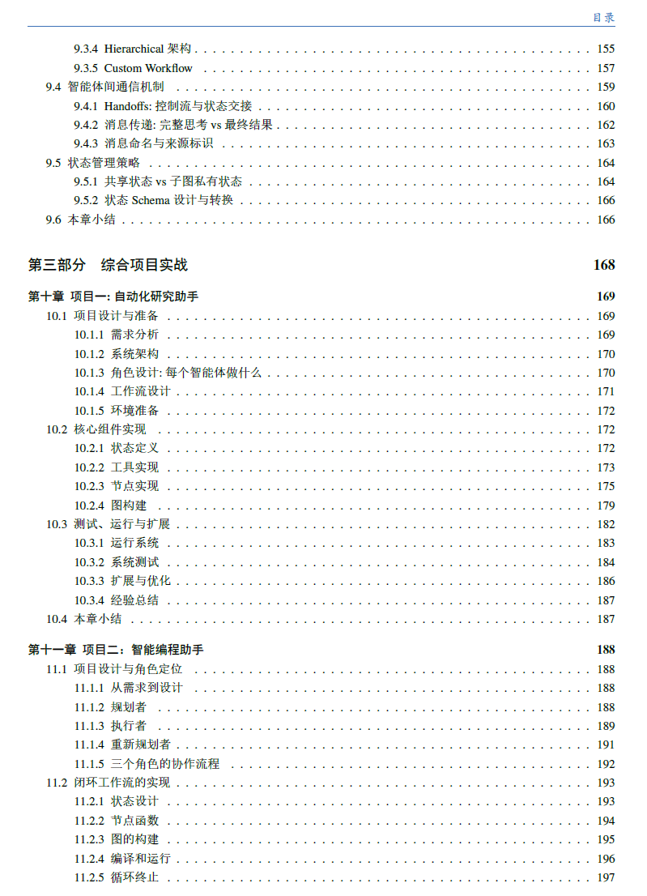
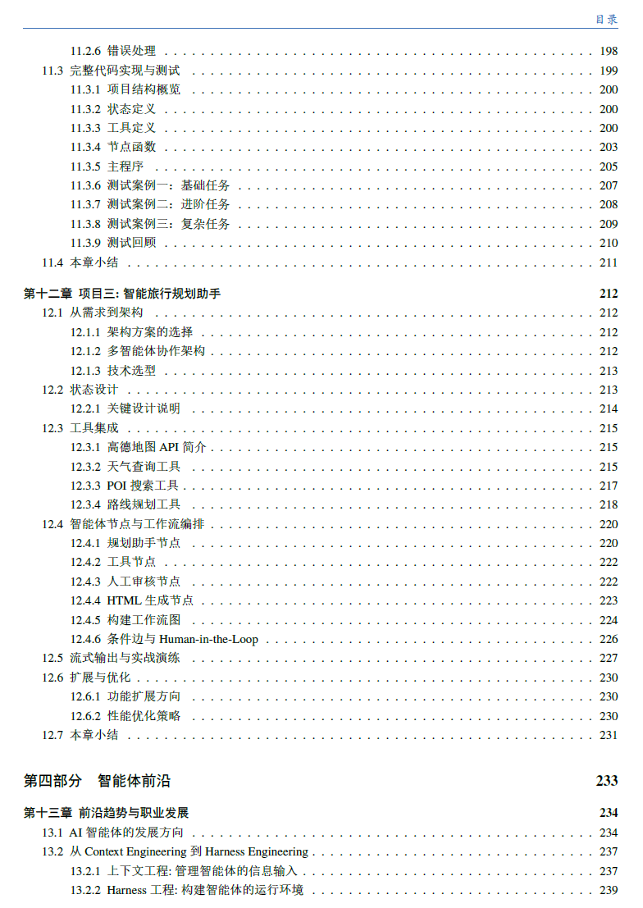
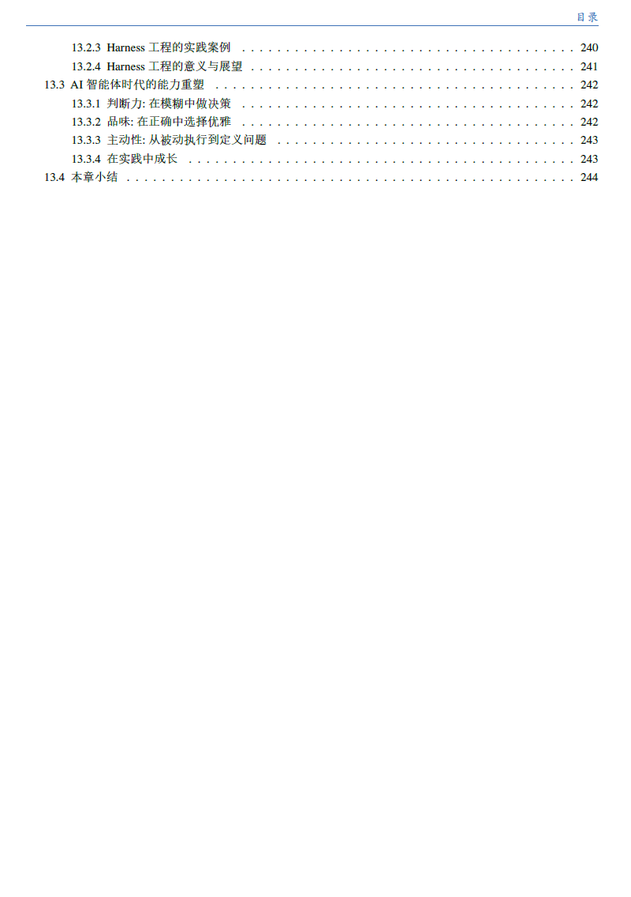

<div align="center">


<p>
  <a href="https://www.python.org/downloads/"></a>
  <a href="https://github.com/langchain-ai/langgraph"></a>
  <a href="https://github.com/langchain-ai/langchain"></a>
  <a href="https://github.com/astral-sh/uv"></a>
  <a href="https://opensource.org/licenses/MIT"></a>
</p>

</div>

本项目包含了《LangGraph AI智能体开发实战》一书的所有配套代码。为方便读者学习与运行，所有代码均按章节进行组织。**除了第1章和第13章以理论为主没有代码外，其他章节的实战代码均存放在对应的文件夹当中。**

<div align="center"></div>

## 书籍简介

《LangGraph AI智能体开发实战》系统性地介绍了 AI Agent 开发的核心原理与前沿的工程实践。全书内容主要涵盖以下几个核心模块：
1. **Agent核心底座**：从大语言模型的基础能力出发，深入探讨认知架构中的规划(Planning)、记忆(Memory)与工具使用(Tool Use)等核心组件及演进路线。
2. **框架技术深度剖析**：详细讲解 LangGraph 这一专为复杂 Agent 编排设计的图架构框架。通过状态机与计算图的设计理念，实现了可控性强、支持流式传输与“人在环路”(Human-in-the-loop)的智能体流水线。
3. **多智能体与高阶控制**：全面涵盖如何利用 LangSmith 调试系统，同时探讨多智能体(Multi-agent)的网络化、监督者及层级协作架构。
4. **实战落地**：通过三大核心项目——“行业调研专家”、“代码工程师”与“旅行规划师”，将理论融会贯通，带领读者完成从 Context Engineering 到 Harness Engineering 的思维与工程范式转换（本书在部分章节有提到关于harness的实践细节，但由于篇幅限制，没有完全展开，期待下一本书）。

<p align="center">
  <table width="100%">
    <tr>
      <td align="center" bgcolor="#FDF7E7">
        <br>
        <h3>书籍电子版封面</h3>
        <br>
        
        <br><br>
        <h4>全书目录</h4>
        <br>
        <p>
          &nbsp;
          &nbsp;
          &nbsp;
          
        </p>
        <p>
          &nbsp;
          &nbsp;
          
        </p>
        <br>
      </td>
    </tr>
  </table>
</p>

<div align="center"></div>

## 章节代码与运行指南

本项目推荐使用 **uv** 作为包管理器与虚拟环境运行工具。运行各章节代码前，请确保在项目根目录已经安装并同步了依赖。

| 章节 | 核心主题 | 代码在做什么 | 运行示例（推荐在根目录或对应目录下执行） |
|:---:|:---|:---|:---|
| **第2章** | 认知架构核心原理 | 演示了智能体的感知、规划、记忆和行动四个维度，实现了基础的思维链(CoT)、工具调用、人工介入机制及多维度智能体评估。 | `uv run chapter2/chapter2_cognitive_architecture.py` |
| **第3章** | 主流Agent框架 | 基于业界核心论文，零基础徒手实现了 ReAct、Reflexion（自我反思）以及 Plan-and-Execute 等主流智能体架构模型。 | `uv run chapter3/chapter3_react_agent.py` |
| **第4章** | FastMCP工具生态 | 实现模型上下文协议(MCP)，演示了如何快速构建 FastMCP 客户端和服务器端，进行无缝的跨系统工具接入与交互。 | 进入 `chapter4_fastmcp` 后阅读目录内的配套指南运行服务端。 |
| **第5章** | LangGraph基础 | 提供 Hello LangGraph 入门体验，构建基础的节点(Node)、边(Edge)与条件路由，完成第一个简单的循环问答交互图。 | `uv run chapter5_hellolangraph/chapter5_hello_langgraph.py` |
| **第6章** | 记忆与流式传输 | 展示 Thread 和 Checkpoint 持久化记忆机制、记忆裁剪(Trim)与摘要打包操作，以及多种流式传输(Streaming)的深度实现。 | `uv run chapter6/01_persistence_basic.py` |
| **第7章** | 控制流与人在环路 | 演示高阶架构技巧：包括子图(Subgraphs)调度、时间旅行(Time Travel)断点调试、人工审批机制与 Functional API 高级操作。 | `uv run chapter7/7_1_human_in_loop_basic.py` |
| **第8章** | 调试与可视化集成 | 演示如何将系统接入 LangSmith 进行全链路 Tracing，以及结合 LangGraph Studio 进行可视化观测和运行监控。 | `uv run chapter8/8_1_langsmith_tracing_basic.py` |
| **第9章** | 多智能体架构设计 | 演示了多智能体协作的核心范式：包括直连网络化、Supervisor监督者模式、层级架构以及使用自定义工作流完成智能体交接(Handoff)。 | `uv run chapter9/03_supervisor_architecture.py` |
| **第10章** | 深度调研系统实战 | 实现“行业研究专家”，通过研究员、审稿人架构协作完成深度长篇报告的检索、撰写、审查和递归修订。 | `cd chapter10 && uv run main.py` |
| **第11章** | 代码开发工具实战 | 实现“代码工程师”，包含自动化的代码生成、安全测试、错误捕获与修复回环，同时包含了图结构的可视化输出。 | `cd chapter11 && uv run test_all.py` |
| **第12章** | 复杂环境规划实战 | 构建“武汉旅行规划师”，结合本地 POI 知识库，利用动态状态管理与高频“人在环路”沟通，完成多轮对话式的复杂行程规划。 | `cd chapter12 && uv run main.py` |

<div align="center"></div>

## 快速开始

### 1. 环境准备与依赖安装

本项目推荐使用 `uv` 进行高效的依赖管理。在项目根目录下执行以下命令，即可秒级创建虚拟环境并安装所有相关依赖：

```bash
uv sync
```

### 2. 环境变量与大模型配置

本项目的所有代码默认采用标准的 **OpenAI 兼容接口**方式来调用大语言模型。这意味着你不仅可以使用官方的 OpenAI，还可以无缝切换为任何支持该规范的国产大模型（例如 DeepSeek、Qwen 千问等）。

请在项目根目录新建或重命名出一个 `.env` 文件，并在其中进行如下配置：

```env
# ==========================================
# 1. AI 模型配置（必填）
# 以接入 DeepSeek 为例，只需指定其网关 URL 及名称即可
# 如采用原生 OpenAI，则只需配置 API_KEY，另外两项留空或注释即可
# ==========================================
OPENAI_BASE_URL="https://api.deepseek.com/v1"
OPENAI_API_KEY="sk-你的模型API密钥"
OPENAI_MODEL_NAME="deepseek-chat"

# ==========================================
# 2. 第三方工具与 MCP 协议配置（特定实战章节使用）
# ==========================================
# 适用于需要调用地图能力与 MCP 协议的演练项目（如第4/12章）
GAODE_API_KEY="你的高德 Web服务 API Key"
AMAP_API_KEY="你的高德地图 API Key"
AMAP_BASE_URL="https://restapi.amap.com/v3"

# ==========================================
# 3. LangSmith 监控配置（第8章及调试使用）
# ==========================================
LANGSMITH_API_KEY="lsv2_pt_你的LangSmith密钥"
```

### 3. 运行代码

环境及密钥配置完成后，你就可以通过表格中提供的示例命令来运行具体的配套代码了。例如，想要体验一个基础的图结构，不妨输入：

```bash
uv run chapter5_hellolangraph/chapter5_hello_langgraph.py
```

如果你在运行中对任何概念或代码实现机制有疑惑，请随时回归书籍相关章节。代码中的系统注释也与书中内容做到了充分互补，祝你实践愉快！

<div align="center"></div>

## 出版与开源计划

**《LangGraph AI智能体开发实战》的实体书即将正式出版，敬请期待！**

目前本书的核心配套代码与工程目录已全量开放。为回馈社区，在实体书籍正式出版发行后，我们将在此开源**本书完整的电子版本**。欢迎 Star 和持续关注本项目，与广大从业者共同推动 AI 智能体应用的工程落地！
